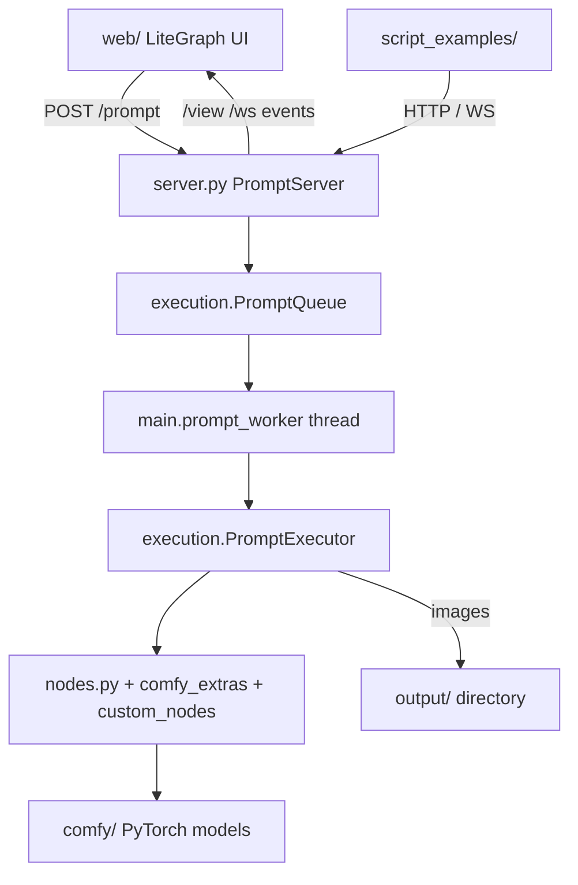

# ComfyUI

> **Problem thesis (required):** ComfyUI exists so anyone working with Stable Diffusion can design, run, and automate complex diffusion pipelines through a visual node graph that mirrors how SD actually works — loading checkpoints, conditioning, sampling, VAE decode, post-processing — while a built-in async server exposes the same execution engine to scripts and external clients. It prioritizes modularity, partial re-execution of only changed subgraphs, broad model-format support, and offline operation over a simplified one-click consumer UI.

## 1. Identity

| Field | Value |
|-------|-------|
| Org / repo | `kodexArg/ComfyUI` |
| Visibility | `private` |
| Default branch | `master` |
| One-line pitch | The most powerful and modular stable diffusion GUI, API and backend with a graph/nodes interface. |
| Audience | ML practitioners, SD hobbyists, pipeline engineers, and integrators who want fine-grained control over diffusion workflows; operators running local GPU or CPU inference servers; authors of custom node extensions. |

The `kodexArg` copy tracks the upstream ComfyUI codebase (GPL-3.0, README and `tests-ui/package.json` still reference the original author). GitHub metadata shows it is not registered as a fork (`isFork: false`) but content and structure match the canonical ComfyUI application. Last remote activity on the org mirror was August 2024.

## 2. Problems it solves

### P1 — Composing advanced SD workflows without writing code

- **Who hurts:** Artists and researchers who need hires-fix passes, regional prompting, inpainting, ControlNet stacks, LoRA stacking, or model merges — workflows that exceed a single txt2img form.
- **Pain today:** Tab-based UIs encode fixed pipelines; escaping those patterns means maintaining private Python glue or fragile UI macros. Each new technique (SDXL, SVD, LCM, GLIGEN) adds another screen instead of composable primitives.
- **How this repo answers:** Every operation is a **node** with typed inputs/outputs (`MODEL`, `LATENT`, `CONDITIONING`, `IMAGE`, etc.). Users wire nodes in a LiteGraph canvas (`web/`). Built-in nodes live in `nodes.py`; extended techniques ship in `comfy_extras/`; third parties add `custom_nodes/`. Workflows serialize to JSON; PNG outputs embed workflow metadata for round-tripping. The README documents shortcuts for queueing, bypassing, and muting nodes.
- **Out of scope:** Training new base models, cloud-hosted inference SaaS, or a simplified “one button” consumer app experience.

### P2 — Transparent, efficient execution of diffusion graphs

- **Who hurts:** Power users iterating on the last steps of a large graph (e.g. change only the KSampler seed or final upscale) on hardware where full pipeline re-runs are costly.
- **Pain today:** Naive executors rerun the entire DAG every time, wasting GPU time reloading encoders and re-encoding prompts.
- **How this repo answers:** `execution.py` implements `PromptExecutor` with validation, topological execution, and **change detection** — only nodes whose inputs changed (or that depend on changed upstream nodes) re-execute. README §Notes states explicitly that unchanged duplicate submissions skip work. `comfy/model_management.py` handles VRAM tiers (`--lowvram`, `--novram`, `--highvram`, `--cpu`), model unload, and interrupt handling. `main.py` runs a background `prompt_worker` thread consuming an async `PromptQueue`.
- **Out of scope:** Distributed multi-GPU orchestration across machines; automatic hyperparameter search.

### P3 — Headless API and automation over the same graphs

- **Who hurts:** Developers building batch generators, CI image regression tests, Colab/Jupyter notebooks, or external frontends that must queue the same workflows the GUI uses.
- **Pain today:** GUI-only tools force screen-scraping or duplicate inference code paths; API layers often lag behind UI features.
- **How this repo answers:** `server.py` (`PromptServer`) serves REST endpoints and a WebSocket channel on port 8188 by default. Clients POST JSON prompts to `/prompt`, poll `/history`, stream progress on `/ws`, and fetch images via `/view`. `script_examples/basic_api_example.py` and `script_examples/websockets_api_example.py` demonstrate queue + completion patterns. `/object_info` introspects all registered node classes for dynamic client builders.
- **Out of scope:** Built-in authentication, rate limiting, or multi-tenant cloud deployment — the server binds to loopback by default and assumes a trusted local operator.

### P4 — Running SD on constrained or diverse hardware

- **Who hurts:** Users with &lt;3 GB VRAM GPUs, CPU-only hosts, AMD ROCm Linux boxes, Apple Silicon, Intel Arc, or Windows DirectML paths.
- **Pain today:** Single-code-path UIs assume 8+ GB NVIDIA CUDA and fail obscurely elsewhere.
- **How this repo answers:** `comfy/cli_args.py` exposes a large matrix of device and precision flags (`--directml`, `--force-fp16`, fp8 UNET modes, attention backends, `--disable-xformers`, etc.). README documents per-vendor install commands and env overrides (`HSA_OVERRIDE_GFX_VERSION`). `--lowvram` auto-enables on small cards; `--cpu` forces CPU inference.
- **Out of scope:** Guaranteed performance parity across vendors; automatic driver installation.

## 3. Product / idea

ComfyUI is a **local-first diffusion runtime** packaged as three cooperating layers:

1. **Core inference library (`comfy/`)** — PyTorch implementations of SD1.x/2.x/SDXL loaders, samplers (`k_diffusion/`, `extra_samplers/`), VAE, CLIP, ControlNet, GLIGEN, LoRA application, latent formats, and model detection/patching. This is the “engine.”
2. **Node registry and executor (`nodes.py`, `comfy_extras/`, `execution.py`)** — Python classes declaring `INPUT_TYPES`, `RETURN_TYPES`, and a `FUNCTION` entrypoint. `NODE_CLASS_MAPPINGS` is the plugin registry; `init_custom_nodes()` loads bundled extras then scans `custom_nodes/`.
3. **Server + web UI (`server.py`, `main.py`, `web/`)** — aiohttp serves the static LiteGraph frontend and JSON/WebSocket APIs. A daemon thread drains the prompt queue while the asyncio loop handles I/O and pushes `progress`, `executing`, and preview events to connected clients.

The mental model: **a workflow is a JSON dict of node IDs → `{class_type, inputs}`**, not a linear script. Inputs reference upstream outputs as `[node_id, output_index]` tuples. The executor validates types, resolves the DAG, and runs output nodes (e.g. `SaveImage`) and their ancestors. User settings and multi-user profiles (optional) persist under `user/` via `app/user_manager.py`.



### 3.1 North-star use cases

1. **Interactive experimentation:** Operator loads checkpoints into `models/checkpoints/`, builds a txt2img or SDXL graph in the browser, queues with Ctrl+Enter, tweaks seeds or LoRA weights, and benefits from partial re-execution on subsequent runs.
2. **Advanced technique stacks:** Wire ControlNet, regional conditioning (area composition), inpainting, latent upscales, model merges, or video diffusion nodes from `comfy_extras/nodes_video_model.py` without leaving the graph paradigm.
3. **Headless batch / integration:** External Python or any HTTP client posts API-format prompts (enabled via UI dev mode per `script_examples/basic_api_example.py`), listens on WebSocket for completion, downloads results from `/history` + `/view`.
4. **Extension authoring:** Developer drops a package into `custom_nodes/` implementing `NODE_CLASS_MAPPINGS` (see `custom_nodes/example_node.py.example`) and optional `WEB_DIRECTORY` for frontend JS extensions under `web/extensions/`.
5. **Shared model libraries:** Operator copies `extra_model_paths.yaml.example` → `extra_model_paths.yaml` (gitignored) to point at checkpoints shared with A1111 or another Comfy install.

### 3.2 Non-goals

- **No automatic model downloads** — README states the app “works fully offline” and will never download weights; operators supply `models/` content manually.
- **Not a training framework** — fine-tuning or dataset tooling is out of scope; focus is inference and workflow composition.
- **Not a secured multi-user server** — `--multi-user` only partitions userdata on disk; there is no auth layer on API routes.
- **Pre-alpha API stability** — `basic_api_example.py` warns the prompt JSON format may change.

## 4. Technology stack

| Layer | Choices | Evidence (path, not URL) |
|-------|---------|--------------------------|
| Runtime / language | Python 3.8–3.11 tested in CI; README warns 3.12 needs PyTorch nightly | `.github/workflows/test-build.yml`, `README.md` |
| ML framework | PyTorch, torchvision, torchsde | `requirements.txt` |
| Model ecosystem | transformers ≥4.25.1, safetensors ≥0.3.0, einops | `requirements.txt` |
| HTTP server | aiohttp `web.Application`, WebSocket | `server.py`, `requirements.txt` |
| Image I/O | Pillow | `requirements.txt`, `nodes.py` |
| Frontend | Vanilla JS, LiteGraph (`web/lib/litegraph.core.js`), CSS | `web/index.html`, `web/scripts/app.js` |
| Config | PyYAML for extra model paths | `extra_model_paths.yaml.example`, `main.py` |
| Inference tests | pytest + websocket-client, opencv, scikit-image (manual install) | `tests/README.md`, `pytest.ini` |
| UI tests | Jest 29 + jsdom + Babel | `tests-ui/package.json`, `tests-ui/jest.config.js` |
| CI | GitHub Actions — Python dep matrix, Windows release packaging, UI tests | `.github/workflows/` |
| License | GPL-3.0 | `LICENSE`, `tests-ui/package.json` |

### 4.1 Notable dependencies (curated)

- `torch` / `torchvision` — core tensor runtime and image ops; CUDA/ROCm/DirectML/MPS selected at install time per README, not pinned in `requirements.txt`.
- `transformers` — CLIP/tokenizer integrations inside `comfy/` text encoders.
- `safetensors` — preferred checkpoint format; `/view_metadata/{folder}` reads safetensors headers.
- `aiohttp` — async routes, file upload, WebSocket progress streaming.
- `einops` — tensor rearrangement in model code.
- `torchsde` — stochastic sampler support.
- LiteGraph (vendored in `web/lib/`) — node canvas, grouping, reroutes; extensions in `web/extensions/core/`.

## 5. Repository map (abstraction)

- **Entrypoints**
  - `main.py` — CLI parse (`comfy/cli_args.py`), custom-node prestartup, spawns `PromptServer`, starts `prompt_worker`, optional browser auto-launch.
  - `server.py` — HTTP/WebSocket route definitions and static `web/` hosting.
- **Domain / core**
  - `comfy/` — diffusion models, sampling, LoRA, ControlNet, VAE, CLIP, model management, supported model configs (`supported_models.py`, `model_detection.py`).
  - `nodes.py` — built-in node classes and `NODE_CLASS_MAPPINGS`; also custom-node loader.
  - `comfy_extras/` — bundled advanced nodes (video, merge, SAG, PerpNeg, custom samplers, etc.) loaded explicitly in `init_custom_nodes()`.
  - `execution.py` — prompt validation, DAG execution, queue data structures.
  - `folder_paths.py` — canonical paths for checkpoints, LoRAs, VAE, embeddings, controlnet, input/output/temp/user dirs.
- **Adapters**
  - `server.py` — REST/WS adapter to the executor.
  - `latent_preview.py` + `comfy/taesd/` — preview generation (TAESD optional weights in `models/vae_approx/`).
  - `cuda_malloc.py` — CUDA allocator compatibility checks.
- **Extension zones**
  - `custom_nodes/` — gitignored except `example_node.py.example`; runtime plugin drop-in directory.
  - `web/extensions/core/` — first-party JS UI extensions (mask editor, group nodes, keybinds, etc.).
- **Docs vaults**
  - Root `README.md` only — no `docs/`, `.docs/`, or `.claude/` present in tree (see §8).
- **Models & I/O (gitignored at runtime)**
  - `models/` — directory scaffold with YAML configs and empty category folders; actual weights not in repo.
  - `input/`, `output/`, `temp/`, `user/` — runtime data; `.gitignore` excludes most contents.
- **Examples & notebooks**
  - `script_examples/` — HTTP and WebSocket API samples.
  - `notebooks/comfyui_colab.ipynb` — hosted notebook entry (not ingested; path noted).
- **Tests**
  - `tests/inference/` — graph JSON fixtures + pytest inference runs.
  - `tests/compare/` — image quality regression between baselines.
  - `tests-ui/` — Jest unit tests for frontend widgets and group nodes.
- **Packaging / release**
  - `.ci/` — Windows standalone build helpers.
  - `.github/workflows/` — `test-build.yml`, `test-ui.yaml`, Windows release pipelines.

## 6. Configuration & contracts (no secrets)

### CLI flags (selected)

All defined in `comfy/cli_args.py`:

| Flag | Purpose |
|------|---------|
| `--listen [IP]` | Bind address (default `127.0.0.1`; bare `--listen` → `0.0.0.0`) |
| `--port` | HTTP port (default `8188`) |
| `--enable-cors-header [ORIGIN]` | CORS middleware |
| `--max-upload-size` | Upload cap in MB (default 100) |
| `--output-directory`, `--input-directory`, `--temp-directory` | Override I/O roots |
| `--extra-model-paths-config` | Load additional YAML path maps |
| `--auto-launch` / `--disable-auto-launch` | Browser open on start |
| `--cuda-device` | Select GPU index |
| `--lowvram`, `--novram`, `--highvram`, `--gpu-only`, `--cpu` | Memory strategy |
| `--preview-method` | `none` \| `auto` \| `latent2rgb` \| `taesd` |
| `--multi-user` | Server-side userdata partitions + `/users` API |
| `--quick-test-for-ci` | Exit after init (CI smoke) |
| `--deterministic` | Slower deterministic CUDA algorithms |

### Env / files (names only)

- `CUDA_VISIBLE_DEVICES` — set when `--cuda-device` passed (`main.py`).
- `CUBLAS_WORKSPACE_CONFIG` — set when `--deterministic` (`main.py`).
- `HSA_OVERRIDE_GFX_VERSION` — documented AMD workaround in README (operator-set).
- `extra_model_paths.yaml` — gitignored; extends `folder_paths` search dirs (see example file).
- `user/users.json` — created when `--multi-user`; maps user IDs to display names.
- `user/{id}/comfy.settings.json` — per-user UI settings (`app/app_settings.py`).

### Model folder taxonomy

From `folder_paths.py`: `checkpoints`, `configs`, `loras`, `vae`, `clip`, `unet`, `clip_vision`, `style_models`, `embeddings`, `diffusers`, `vae_approx`, `controlnet` (includes `t2i_adapter`), `gligen`, `upscale_models`, `hypernetworks`, `custom_nodes`.

### 6.1 HTTP / API endpoints

Default base: `127.0.0.1:8188`. No authentication on routes unless placed behind an external reverse proxy.

| Method | Path | Purpose | Auth (if known) |
|--------|------|---------|-----------------|
| `GET` | `/` | Serves `web/index.html` | none |
| `GET` | `/ws` | WebSocket — status, `progress`, `executing`, binary previews | none; optional `clientId` query |
| `GET` | `/embeddings` | List embedding names | none |
| `GET` | `/extensions` | List JS extension URLs (core + custom `WEB_DIRECTORY`) | none |
| `POST` | `/upload/image` | Upload image to input/temp/output tree | none |
| `POST` | `/upload/mask` | Upload alpha mask merged into existing PNG | none |
| `GET` | `/view` | Serve or preview image by filename/type/subfolder/channel | none; path traversal guarded |
| `GET` | `/view_metadata/{folder_name}` | Safetensors metadata header | none |
| `GET` | `/system_stats` | OS, Python, device VRAM stats | none |
| `GET` | `/prompt` | Queue exec info (`queue_remaining`) | none |
| `POST` | `/prompt` | Submit workflow JSON; returns `prompt_id` | none |
| `GET` | `/object_info` | Full node catalog with input/output schemas | none |
| `GET` | `/object_info/{node_class}` | Single node schema | none |
| `GET` | `/queue` | Running and pending queue snapshots | none |
| `POST` | `/queue` | Clear or delete queued items | none |
| `GET` | `/history` | Execution history (optional `max_items`) | none |
| `GET` | `/history/{prompt_id}` | History for one prompt | none |
| `POST` | `/history` | Clear or delete history entries | none |
| `POST` | `/interrupt` | Abort current processing | none |
| `POST` | `/free` | Request model unload / memory free flags | none |
| `GET` | `/users` | Multi-user storage metadata | none |
| `POST` | `/users` | Register username (multi-user mode) | none |
| `GET` | `/userdata/{file}` | Fetch per-user file | `comfy-user` header when multi-user |
| `POST` | `/userdata/{file}` | Write per-user file | `comfy-user` header when multi-user |
| `GET` | `/settings` | Read merged UI settings JSON | none |
| `GET` | `/settings/{id}` | Read single setting key | none |
| `POST` | `/settings` | Merge settings object | none |
| `POST` | `/settings/{id}` | Set single setting key | none |
| static | `/extensions/{name}/**` | Custom node frontend assets | none |

WebSocket message types (from `server.py` / `main.py` usage): `status`, `progress`, `executing`, plus binary `UNENCODED_PREVIEW_IMAGE` events.

### 6.2 Other interfaces

- **CLI:** `python main.py` with flags above; `--quick-test-for-ci` for smoke init.
- **Custom node Python API:** implement `INPUT_TYPES`, `RETURN_TYPES`, `FUNCTION`, optional `OUTPUT_NODE`, `CATEGORY`, register in `NODE_CLASS_MAPPINGS`; optional `prestartup_script.py` for early imports.
- **Workflow JSON:** API prompt format — dict keyed by string node IDs; consumed by `/prompt` and validated in `execution.validate_prompt`.
- **PNG workflow embedding:** UI can load workflow metadata from generated PNGs (README §Notes).

## 7. Data & persistence

- **No application database** — state is in-memory (`PromptQueue`, executor caches) plus filesystem artifacts.
- **Outputs** — raster images (PNG with optional metadata), saved checkpoints/LoRAs when using save nodes into `output/` subfolders registered in `main.py`.
- **Inputs** — uploaded or dropped images land in `input/` (or overridden input directory).
- **Temp** — intermediate latents/previews under `temp/`; cleaned on startup/shutdown (`cleanup_temp` in `main.py`).
- **User data** — `user/` tree holds settings and arbitrary userdata files when server-side storage is enabled.
- **Models** — large weight files live under `models/**` on disk; repo ships only configs (e.g. `models/configs/v1-inference.yaml`) and empty category folders.
- **Topology:** single-process, single-machine inference server; optional browser clients on LAN if `--listen 0.0.0.0`. No built-in replication or object storage — operators sync `models/` via their own means.

## 8. Docs & agent memory (required scan)

| Source | Result |
|--------|--------|
| `README.md` | **Present** — install matrix (Windows portable, NVIDIA/AMD/Apple/DirectML), features list, shortcuts, running notes, preview/TAESD setup, FAQ. Primary product documentation. |
| `docs/` | **Absent** — directory not in repository. |
| `.docs/` | **Absent** — hidden docs vault not present. |
| `.claude/` | **Absent** — no agent instruction tree. |
| `tests/README.md` | **Present** — how to run pytest inference and quality regression compares. |
| `custom_nodes/example_node.py.example` | **Present** — documents custom node class contract. |
| `script_examples/*.py` | **Present** — API usage patterns and format warnings. |
| `notebooks/comfyui_colab.ipynb` | **Present** — Colab-oriented entry (not opened; path only). |
| ADR / PRD / constitution | **Not found** — no `adr/`, `PRD.md`, or harness files in tree. |

Evidence bullets:

- `README.md` — feature set, hardware install paths, execution semantics.
- `tests/README.md` — CI/local inference test expectations.
- `custom_nodes/example_node.py.example` — extension authoring contract.
- `script_examples/basic_api_example.py` — `/prompt` JSON shape.
- `extra_model_paths.yaml.example` — shared model path configuration schema.

## 9. Security & privacy notes (summary-time)

- **Visibility:** `private` org mirror — treat as internal reference copy of a public upstream project; this summary intentionally omits clone URLs and live connection strings.
- **Auth model:** **None by default.** Server listens on loopback; exposing via `--listen 0.0.0.0` grants LAN clients full prompt execution, file read/write under input/output trees, and interrupt capability. `--multi-user` only namespaces `userdata` files; it is not an authentication system.
- **Path traversal:** `/view` and upload handlers validate paths stay within typed roots (`server.py`).
- **Secrets:** No `.env`, credentials, or keys belong in the repo. `extra_model_paths.yaml` is gitignored. This summary contains no secrets.
- **Offline / privacy:** README emphasizes no automatic downloads — workflows and weights stay on operator hardware.
- **GPL-3.0:** Derivative distribution obligations apply if modified binaries are shared.

## 10. Operational picture

### Local development

```bash
pip install -r requirements.txt
# install torch per README for your GPU vendor
python main.py
```

Optional: `python main.py --listen 0.0.0.0 --port 8188` for LAN access; `--auto-launch` opens browser.

### Testing

- Python: `pytest tests/inference` (extra deps per `tests/README.md`).
- UI: `cd tests-ui && npm test` (Jest).
- CI smoke: `python main.py --quick-test-for-ci`.

### Deployment patterns

- **Windows portable** — release artifacts built by `.github/workflows/windows_release_*.yml` (embedded Python, cu121 or CPU).
- **Manual** — git clone + venv on Linux/macOS/Windows.
- **Jupyter** — `notebooks/comfyui_colab.ipynb` for cloud notebook hosts.
- **kodexArg org** — no project-specific deploy manifest beyond upstream GitHub Actions; not wired to Cloudflare or internal ALVS infra in this tree.

### Hardware constraints

- GPU strongly recommended; `--cpu` supported but slow.
- VRAM modes from 3 GB (`--lowvram`) upward; `--novram` for extreme offload.
- TAESD preview weights optional in `models/vae_approx/`.
- xformers / PyTorch cross-attention backends affect speed and compatibility.

## 11. Open questions / unknowns

- **Divergence from upstream:** Whether `kodexArg/ComfyUI` will receive ongoing merges from upstream ComfyUI or remain a frozen August 2024 snapshot is not documented in-repo.
- **Private mirror rationale:** No README or org note explains why the codebase lives under `kodexArg` with `private` visibility despite upstream being public — operational intent unknown.
- **Production hardening:** No reverse-proxy, TLS, or API-key patterns are defined in this repository.
- **Exact PyTorch/CUDA pins:** `requirements.txt` lists `torch` without version pin; reproducible envs depend on operator install commands in README.
- **Colab notebook contents:** `notebooks/comfyui_colab.ipynb` not summarized line-by-line.
- **Custom nodes in production:** Any private `custom_nodes/` content would be gitignored and invisible in this clone.
