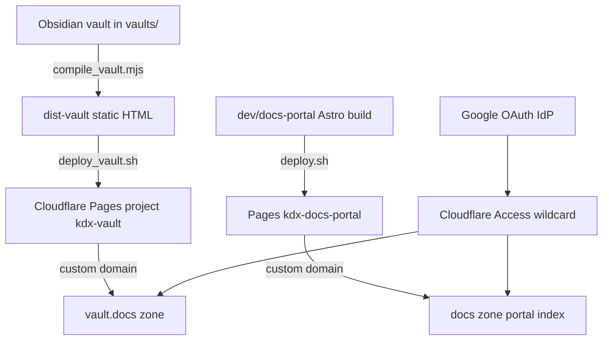

# docs-portal

> **Problem thesis (required):** docs-portal is the kodexArg **personal documentation platform**: it turns clean Obsidian vault folders into Google-authenticated static websites on Cloudflare Pages, and provides a Tone-themed Astro portal that indexes all vaults from a central dashboard. The repository solves the split between **authoring** (100% Obsidian-compatible markdown in `vaults/`) and **publishing** (Node compile step + Pages deploy scripts), while encoding operational knowledge about which DNS subtrees can be Access-gated for free and which cannot.

## 1. Identity

| Field | Value |
|-------|-------|
| Org / repo | `kodexArg/docs-portal` |
| Visibility | `private` |
| Default branch | `main` |
| One-line pitch | Compile Obsidian vaults to static HTML, deploy each vault and a shared portal index behind Cloudflare Access, with one wildcard auth policy covering all docs subdomains. |
| Audience | Primary operator (Gabriel Cavedal); AI agents maintaining vaults and deployment; readers of hosted documentation after Google login. |

## 2. Problems it solves

### P1 — Obsidian notes need web publishing without contaminating the vault

- **Who hurts:** A solo operator maintaining technical documentation in Obsidian who wants browser access from any device without running Obsidian Sync or exposing raw folders.
- **Pain today:** Typical SSG workflows require markdown inside the framework repo, mixed with components and config. That breaks the Obsidian mental model: wikilinks, callouts, and attachments expect a pure note tree. Copying notes into an Astro project duplicates content and drifts from the canonical vault.
- **How this repo answers:** `vaults/` holds **only** markdown and attachments—no JS, no Astro, no HTML. `compile_vault.mjs` reads a vault by name, resolves wikilinks to shortest-path URLs, renders Obsidian callouts and `![[image]]` embeds, wraps output in a Tone-styled layout with responsive sidebar navigation, and writes static HTML under `dist-<vault-name>/`. Vault folders remain openable directly in Obsidian.
- **Out of scope:** Real-time collaboration, bidirectional sync, search indexing inside compiled vaults (portal index has pagefind; per-vault search is sidebar navigation only), and WYSIWYG editing in the browser.

### P2 — Many doc sites, one front door and one auth policy

- **Who hurts:** The operator managing Coveris, ALVS, SyV character-kit, and future internal docs who does not want to configure Cloudflare Access separately for every new site.
- **Pain today:** Each static site on Pages is public by default. Gating requires per-project Access apps, DNS records, and policy maintenance. Without a catalog, readers forget which subdomain hosts which body of knowledge.
- **How this repo answers:** `dev/docs-portal/` is an Astro 6 site using the **Tone** theme. At build time `src/pages/index.astro` scans `../../vaults/`, counts markdown notes recursively, and renders a dashboard of vault cards linking to each vault's docs subdomain. `deploy.sh` builds the portal, deploys to Pages project `kdx-docs-portal`, wires the primary docs hostname, and creates a wildcard Access application covering the portal and `*.docs` subdomains under the same Google IdP. `deploy_vault.sh <vault>` compiles one vault and deploys to `kdx-<vault>` with hostname `<vault>.docs.<zone>`.
- **Out of scope:** Multi-tenant auth beyond the email allowlist in deploy scripts; CMS or dynamic vault registration without redeploying the portal.

### P3 — Cloudflare Access only works on proxied zones (DNS gotcha)

- **Who hurts:** Anyone attempting free Gmail-gated sites on delegated subzones (notably the dev subtree routed to AWS Route 53).
- **Pain today:** A Pages custom domain CNAME in a non-Cloudflare zone can serve TLS and content but **does not enforce Access**—the site stays public. This failure mode was documented after a real incident in `CLOUDFLARE.md`.
- **How this repo answers:** `AGENTS.md` and `CLOUDFLARE.md` codify the rule: secure documentation lives on the docs subtree or apex zone under Cloudflare proxy, never on the dev subtree unless a dedicated Cloudflare zone is sub-delegated (requires zone-create capability). `deploy.sh` and `deploy_vault.sh` only create proxied CNAMEs in the main zone. The playbook in `CLOUDFLARE.md` is reusable for future Pages + Access sites.
- **Out of scope:** Enterprise Cloudflare for SaaS custom hostnames; Workers-based hosting (account tokens documented as Pages+Access only, not Workers).

### P4 — Agent-assisted vault authoring needs conventions

- **Who hurts:** AI agents editing Obsidian vaults or deploying docs who need syntax and Cloudflare deployment guardrails.
- **How this repo answers:** `.agents/skills/` bundles Obsidian markdown reference, Obsidian bases, Cloudflare wrangler/workers skills (vendor tree), find-skills, and skill-creator tooling. Vaults like `syv-character-kit` ship their own `AGENTS.md` with editorial policy (rolling-release PRDs, schema sync rules, lore canon boundaries).
- **Out of scope:** The repo does not run agents; it only stores instruction trees.

## 3. Product / idea

The mental model is **three layers**:

1. **Authoring layer** — Obsidian vault directories under `vaults/<name>/` with wikilinks, YAML frontmatter, callouts, and attachments. Obsidian workspace metadata lives under `.obsidian/` (plugin config tracked; runtime UI state gitignored).
2. **Compile layer** — `compile_vault.mjs` (root) transforms each `.md` note into a directory of `index.html` files preserving slug paths. A shared HTML template injects Tone-derived CSS tokens, mobile hamburger sidebar, broken-link styling, and vault branding. The root `package.json` depends only on `marked`.
3. **Publish layer** — Bash scripts source operator credentials from `~/.cloudflare.env` (not in repo), invoke `wrangler pages deploy`, manage DNS CNAMEs via Cloudflare API, and attach Access apps/policies. Portal index follows a parallel path: `npm run build` inside `dev/docs-portal` (Astro + pagefind), then `deploy.sh`.

The portal dashboard is customized beyond stock Tone: typography scaled up 10–15% in `dev/docs-portal/src/styles/tokens.css`, Spanish hero copy, vault card grid with gradient slots, and dynamic note counts. Theme source of truth also exists at `themes/tone/` (upstream Tone clone); `dev/docs-portal/` is the deployed portal instance.

### 3.1 North-star use cases

1. **Add a vault** — Create `vaults/my-project/` with markdown only, run `./deploy_vault.sh my-project`, confirm Google-gated site at the matching docs subdomain; portal index picks it up on next `deploy.sh` build.
2. **Edit in Obsidian** — Open the vault folder locally, edit wikilinks and callouts, re-run compile + deploy; no framework files touched.
3. **Stand up another gated static site** — Follow `CLOUDFLARE.md` recipe with project/host variables; reuse Google IdP id and zone constants documented there.
4. **Agent edits SyV character kit docs** — Read vault `AGENTS.md`, apply rolling-release PRD rules, keep `docs/` schema files consistent; web copy is generated output, not source of truth.

### 3.2 Non-goals

- Not a general-purpose CMS or wiki server with server-side rendering or databases.
- Not a Workers application (Pages-only by token/policy choice documented in `CLOUDFLARE.md`).
- Not responsible for implementing HTTP APIs described inside vault content (e.g. SyV `API.md` is a **contract document** for downstream implementers, not a live service in this repo).
- Does not host content on the dev DNS subtree without explicit sub-zone delegation workflow.
- `.claude/` is gitignored locally and absent from the remote tree; agent config lives in `.agents/` instead.

## 4. Technology stack

| Layer | Choices | Evidence (path, not URL) |
|-------|---------|--------------------------|
| Runtime / language | Node.js (ES modules); Node >=22.12 for Astro portal | `compile_vault.mjs`, `dev/docs-portal/package.json` engines |
| Markdown compile | marked 18, custom Obsidian preprocessors | `package.json`, `compile_vault.mjs` |
| Portal frontend | Astro 6.3, Tone theme, MDX, expressive-code, pagefind | `dev/docs-portal/package.json`, `astro.config.mjs` |
| Theme reference | Tone (hanityx), astro-marketing-theme, aeon-space-agency | `themes/` |
| Static hosting | Cloudflare Pages | `deploy.sh`, `deploy_vault.sh`, `CLOUDFLARE.md` |
| Auth | Cloudflare Access, Google OAuth IdP, email allow policies | `deploy.sh`, `AGENTS.md`, `CLOUDFLARE.md` |
| DNS / TLS | Proxied CNAME to `*.pages.dev`, Pages custom domain certs | `deploy.sh`, `CLOUDFLARE.md` |
| Authoring | Obsidian vaults, optional `.obsidian` plugin config | `vaults/`, `.obsidian/` |
| AI / agents | Agent skills tree (Obsidian + Cloudflare vendor skills) | `.agents/skills/` |
| Adjacent static artifact | ADR map study (standalone HTML) | `dev/adr-map/index.html` |
| Tests | None at repo root; theme subprojects have CI workflows | `themes/tone/.github/workflows/ci.yml` |

### 4.1 Notable dependencies (curated)

- `marked` — Core Markdown-to-HTML for vault compilation; GFM + line breaks enabled.
- `astro` + `@astrojs/mdx` + `astro-expressive-code` — Portal SSG with code blocks and MDX posts (stock Tone demo content still present).
- `pagefind` — Post-build static search index for the portal (`npm run build` runs pagefind on `dist`).
- `reading-time`, `toc-rail`, `rehype-slug`, `rehype-autolink-headings` — Tone reading UX for blog-style pages in the portal.
- `wrangler` (CLI, operator-installed) — Pages project create/deploy; not a package dependency but required by deploy scripts.

## 5. Repository map (abstraction)

- **Entrypoints / ops**
  - `compile_vault.mjs` — CLI: `node compile_vault.mjs <vault-name>` → `dist-<vault-name>/`
  - `deploy.sh` — Portal build + Pages + DNS + Access for main docs hostname
  - `deploy_vault.sh` — Compile vault + Pages + DNS for `<vault>.docs.<zone>`
  - Root `package.json` — marked only (compile dependency)

- **Portal application**
  - `dev/docs-portal/` — Deployable Astro Tone site; custom `index.astro` vault scanner; outputs `dev/docs-portal/dist`
  - `dev/adr-map/` — Self-contained static HTML ADR relationship map (Coveris study); separate Pages project per `CLOUDFLARE.md` live sites table

- **Vaults (content)**
  - `vaults/syv-character-kit/` — Active SyV character kit documentation (PRD, API contract, MODEL, schema docs, GDDRs, mocks). Deployed per `AGENTS.md` catalog.
  - Future vaults (`coveris`, `alvs`) referenced in architecture docs but not present in tree at scan time

- **Themes (templates / forks)**
  - `themes/tone/` — Full Tone theme source with own CI/deploy workflows
  - `themes/astro-marketing-theme/` — Marketing site starter (pnpm workspace, Docker)
  - `themes/aeon-space-agency/` — Astro + Cloudflare adapter example (`wrangler.jsonc`)

- **Docs vaults (in-repo)**
  - `AGENTS.md` — System design, DNS constraints, portal architecture, active Pages mapping
  - `CLOUDFLARE.md` — Reusable Pages + Access + Google login recipe, tear-down, user management

- **Agent scaffolding**
  - `.agents/skills/` — obsidian-markdown, obsidian-bases, find-skills, skill-creator, cloudflare/* (large vendor mirror)
  - `.claude/` — Listed in `.gitignore`; **not present in clone** (local-only agent config)
  - `.docs/` — **Not present** in repository

- **Obsidian workspace**
  - `.obsidian/` — Plugin manifests (appearance, community plugins); workspace JSON gitignored

- **Generated / vendor (do not ingest)**
  - `dist/`, `dist-*/`, `.astro/`, `node_modules/`, `.wrangler/` — gitignored build outputs
  - `themes/*/node_modules`, lockfiles — dependency trees; use manifests only for signal

## 6. Configuration & contracts (no secrets)

### Environment and credentials (operator machine)

Deploy scripts expect a local file `~/.cloudflare.env` (never committed) providing:

| Variable | Purpose |
|----------|---------|
| `CLOUDFLARE_API_TOKEN` | Pages deploy + Access app/policy management |
| `CLOUDFLARE_ACCOUNT_ID` | Account scope for API calls |
| `CF_ZONE_TOKEN` | DNS record create/list in main zone |

Scripts also extend `PATH` with operator wrangler install location. Zone id, account id, and Google IdP id appear as **constants in deploy scripts and docs** for repeatability—not secrets, but this summary omits literal values per RAG hygiene.

### Astro portal configuration

- `dev/docs-portal/astro-theme-config.ts` — Site metadata, nav, comments (giscus off), social placeholders (still Tone defaults in places)
- `ASTRO_SITE_URL`, `ASTRO_SITE_BASE` — Optional env overrides in `astro.config.mjs`
- Portal build output: `dev/docs-portal/dist`

### Compile pipeline configuration

- Vault name: CLI arg to `compile_vault.mjs`, default `syv-character-kit`
- Source: `./vaults/<name>/`
- Output: `./dist-<name>/`
- URL slugs: lowercase paths mirroring relative markdown paths with trailing slash directories

### Cloudflare Pages projects (from architecture docs)

| Logical site | Pages project name | Host pattern |
|--------------|-------------------|--------------|
| Portal index | `kdx-docs-portal` | primary docs hostname |
| Per-vault | `kdx-<vault-name>` | `<vault-name>.docs.<zone>` |
| ADR map (related) | `kdx-adrmap` | apex-level adrmap hostname |

Access: wildcard app on portal + `*.docs` subtree; per-vault deploy relies on inherited wildcard protection after portal Access setup.

### 6.1 HTTP / API endpoints (when applicable)

**This repository does not expose a runtime HTTP API.** It produces static HTML and deployment automation. There is no application server, Worker entrypoint, or API router in the publish path.

| Surface | Method | Path | Purpose | Auth |
|---------|--------|------|---------|------|
| N/A | — | — | No live HTTP server in this repo | — |

**Static sites after deploy** (browser-facing, all behind Cloudflare Access):

| Method | Path | Purpose | Auth |
|--------|------|---------|------|
| `GET` | `/` | Portal index or vault home / note listing | Cloudflare Access session (Google) |
| `GET` | `/<note-path>/` | Compiled markdown page (`index.html` per note) | Same |
| `GET` | `/posts/*`, `/search`, `/about` | Tone demo routes on portal only | Same |

**Documented API contract inside vault content (not implemented here):** `vaults/syv-character-kit/API.md` specifies REST shapes (`GET /character`, `GET /meta/{categoria}`, CRUD on squads, etc.) for a future SyV implementation. That file is product documentation, not an endpoint served by docs-portal.

### 6.2 Other interfaces

| Interface | Contract |
|-----------|----------|
| `compile_vault.mjs` | `node compile_vault.mjs [vaultName]` — filesystem in, static HTML out |
| `deploy.sh` | No args; builds portal and idempotently ensures Pages/DNS/Access |
| `deploy_vault.sh` | `./deploy_vault.sh <vault_name>` — compile + deploy one vault |
| `dev/docs-portal` npm scripts | `dev`, `build`, `preview`, `check`, `lint` — standard Astro toolchain |
| Agent skills | `.agents/skills/*/SKILL.md` — instruction files for Obsidian and Cloudflare tasks |

## 7. Data & persistence

- **No database** in the docs-portal platform itself. All content is files in git: markdown vaults, static build artifacts (gitignored), and HTML output directories produced at deploy time.
- **Vault entities** (by convention in hosted content): Obsidian notes as files; syv-character-kit adds structured YAML mocks, tag catalogs, and schema docs under `docs/`, `mock/`, `tags/`, `gddr/`.
- **Topology:** Authoring is local/edge (Obsidian on operator machine) → compile runs locally or in CI-less shell → static assets pushed to Cloudflare Pages edge CDN → Access gate at Cloudflare edge before origin fetch. No server-side persistence at request time.

## 8. Docs & agent memory (required scan)

### Sources read and folded in

1. **`AGENTS.md`** — Canonical system design: DNS exclusion of dev subtree, portal vs vault architecture, Tone integration, font scale-up, mobile-first rules, directory layout, security plan (wildcard Access, Google IdP, single-user allow policy), active vault catalog with SyV deployed.
2. **`CLOUDFLARE.md`** — Full Pages + Access recipe; dev subtree delegation trap; external CNAME public-exposure incident; sub-delegation workaround; credential sourcing pattern; live sites table; update/teardown procedures.
3. **`compile_vault.mjs`** — Wikilink resolution, callout preprocessing, image embed handling, Tone-styled HTML shell, sidebar generation, responsive layout JS.
4. **`deploy.sh` / `deploy_vault.sh`** — Build steps, idempotent DNS/domain/Access creation, project naming conventions.
5. **`dev/docs-portal/src/pages/index.astro`** — Dynamic vault catalog scanner and card UI.
6. **`dev/docs-portal/package.json` / `astro.config.mjs`** — Astro 6 stack and integrations.
7. **`vaults/syv-character-kit/AGENTS.md`** — Editorial policy: rolling-release PRD, schema doc sync, GDDR purpose, portable randomness notation, agent lore boundaries.
8. **`vaults/syv-character-kit/PRD.md`** — Product is documentation-only kit for SyV squad characters; artifact map; universe context.
9. **`vaults/syv-character-kit/API.md`** — HTTP contract documentation (downstream implementer spec).
10. **`.agents/skills/obsidian-markdown/SKILL.md`** — Obsidian syntax reference for agents; prefers kepano substrate when available.
11. **`.gitignore`** — Confirms ignored paths: `node_modules`, `dist*`, `.astro`, `.wrangler`, `.claude/`, scratch, Obsidian workspace state.

### Directories scanned per assignment

| Path | Result |
|------|--------|
| `.claude/` | **Absent** — gitignored; not in remote shallow clone |
| `.docs/` | **Absent** — no hidden docs vault at repo root |
| `docs/` (root) | **Absent** — documentation at `AGENTS.md`, `CLOUDFLARE.md`, and inside vaults |
| `.agents/` | **Present** — skills for Obsidian markdown/bases, Cloudflare vendor bundle, skill-creator eval tooling |
| `vaults/syv-character-kit/docs/` | **Present** — schema and model reference markdown for SyV kit |

## 9. Security & privacy notes (summary-time)

- **Visibility:** Private GitHub repository hosting deployment knowledge and internal documentation vaults. Hosted sites are not public internet; Cloudflare Access enforces authentication before static content is served.
- **Auth model:** Google OAuth via Cloudflare Access; allow policies restrict to explicit email addresses configured in deploy scripts (operator-maintained). Wildcard Access app covers portal and docs subdomains so new vault hosts inherit protection without new policies.
- **DNS security constraint:** Documentation stresses that only Cloudflare-proxied hostnames participate in Access. Misconfigured CNAME shortcuts to Pages from non-Cloudflare zones leave content world-readable—documented as a verified failure mode.
- **Secrets hygiene:** This summary contains **no** API tokens, env file contents, PEM material, or connection strings. Deploy scripts reference credential file paths on the operator machine only. Architecture docs contain account/zone/IdP identifiers as operational constants; omitted here where possible for RAG hygiene.
- **Vault content:** SyV kit includes fictional military lore and character data; access still gated at edge.

## 10. Operational picture

### Local development

| Task | Command (from repo root unless noted) |
|------|---------------------------------------|
| Compile vault preview | `node compile_vault.mjs <vault-name>` then open files in `dist-<vault-name>/` |
| Portal dev server | `cd dev/docs-portal && npm install && npm run dev` |
| Portal production build | `cd dev/docs-portal && npm run build` (runs pagefind on dist) |
| Deploy portal | `./deploy.sh` (requires `~/.cloudflare.env` and wrangler) |
| Deploy vault | `./deploy_vault.sh <vault-name>` |

### Deployment

- **Mechanism:** Manual bash scripts invoking `wrangler pages deploy`; not GitHub Actions in this repo root (theme subfolders carry their own CI for upstream theme maintenance).
- **Idempotency:** Scripts check for existing Pages projects, DNS CNAMEs, custom domains, and Access apps before creating.
- **Active deployment (per `AGENTS.md`):** Portal at primary docs hostname; SyV character kit vault at syv-character-kit docs subdomain. Additional vaults and Coveris/ALVS entries listed as planned or externally hosted siblings.

### Hardware constraints

None specific; static generation and Pages deploy are lightweight. Astro portal recommends Node >=22.12.

## 11. Open questions / unknowns

- Whether `coveris` and `alvs` vaults will migrate into this repo's `vaults/` or remain separate Pages projects only linked from the portal index.
- Portal `astro-theme-config.ts` still carries default Tone placeholder author/site metadata—not fully customized to kodexArg branding beyond `index.astro` hero.
- No automated CI in repo root: deploy discipline is operator-triggered; drift risk if vault compile is forgotten before deploy.
- Per-vault static sites lack full-text search (pagefind only on Astro portal); sidebar navigation is the vault UX.
- `.claude/` may exist on operator workstations but is intentionally excluded from git; agent behavior may differ locally vs clone.
- SyV `API.md` describes many REST endpoints; implementing service is explicitly out of scope for docs-portal—unknown which downstream repo will host them.
- `themes/aeon-space-agency` suggests experimentation with Astro-on-Workers pattern, but production docs-portal path is Pages-only per token constraints in `CLOUDFLARE.md`.
