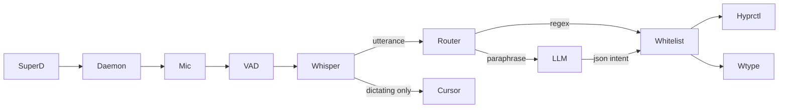

# kodexBot

> **Problem thesis (required):** kodexBot exists so a single Hyprland desktop user can press one hard switch, speak naturally in Spanish or English, and have words typed at the cursor while spoken commands ("switch to workspace two", "press accept") are detected on the same audio stream and executed only through a human-edited whitelist — entirely on local open models within an 8 GB NVIDIA GPU budget, with no cloud fallback and no API keys anywhere in the loop.

## 1. Identity

| Field | Value |
|-------|-------|
| Org / repo | `kodexArg/kodexBot` |
| Visibility | `private` |
| Default branch | `main` |
| One-line pitch | Local, fully-offline voice-to-command and voice-to-text daemon for Hyprland: Super+D hard switch, orange listening / green dictating bar chip, faster-whisper dictation plus regex-and-LLM command routing through a whitelist router. |
| Audience | Primary operator (kodex) on Debian Sid with Hyprland, AGS bar, PipeWire, and an RTX-class 8 GB GPU; secondary audience is AI agents maintaining the repo via its harness (PRD, ADRs, BDDs, skills). |

## 2. Problems it solves

### P1 — Offline voice control on a VRAM-constrained Hyprland desktop

- **Who hurts:** A Hyprland power user who wants dictation and spoken compositor commands without sending audio or transcripts to cloud STT/LLM services, and whose GPU has only 8 GB VRAM shared between desktop compositing and ML models.
- **Pain today:** Cloud assistants require network, keys, and privacy tradeoffs. Generic voice tools do not integrate with Hyprland workspace focus, key injection, or AGS state indicators. Running large STT and interpreter models simultaneously on 8 GB VRAM causes OOM unless carefully budgeted.
- **How this repo answers:** A single Python daemon owns the microphone and a three-state FSM (off / listening / dictating). Lane A runs Silero VAD → faster-whisper large-v3-turbo on CUDA (with CPU fallback on OOM) and types at the cursor via wtype/ydotool. Lane B scans every utterance through a regex fast path (~46 µs) then an OpenAI-compatible local LLM for paraphrases; only whitelist-validated actions reach hyprctl or key macros. Models are pinned, downloaded once via `scripts/download-models.sh`, and documented for Turing sm_75 (no bf16, no TensorRT-LLM).
- **Out of scope:** Wake word / always-on assistant personality, cloud fallback, GNOME/X11 support, managing the LLM server process, or free-form shell generation from model output.

### P2 — Unified dictation + commands without duplicate daemons

- **Who hurts:** The same desktop that previously ran two separate voice services (dictation and voice-live) with two state files, two AGS indicators, and conflicting Super+D binds.
- **Pain today:** Two long-lived audio processes compete for the mic; bar widgets lie or conflict; toggling "off" does not reliably release resources; operators cannot tell whether the system is dictating, listening-only, or absent.
- **How this repo answers:** One daemon (`kodexbot`) with a hard switch (Super+D = toggle off/listening), mode toggle (Super+Shift+D = listening ↔ dictating), atomic JSON state SSOT in `$XDG_RUNTIME_DIR`, and an AGS chip that polls every 150 ms. Off means no process, no state file, no chip — not a paused state. M5 cutover retired legacy dictate/voice-live binds and indicators on the target machine.
- **Out of scope:** Multi-user or multi-seat orchestration; D-Bus service exposure (Unix socket IPC is sufficient for one compositor).

### P3 — Safe command execution when speech mixes prose and intent

- **Who hurts:** Anyone dictating prose that might accidentally contain command-like phrases, or speaking mixed Spanish/English commands alongside text they want typed.
- **Pain today:** Naive voice-command systems execute whatever the LLM returns, including destructive or compositor-escaping actions. Regex-only systems miss paraphrases; LLM-only systems hallucinate executions.
- **How this repo answers:** Trigger-free model: every utterance closes on configurable silence (1.5 s default, no forced cut), enters the router. Regex matches the ≤10-word tail first; if no match, the interpreter LLM returns constrained JSON intent; the router validates against `actions.py` whitelist (workspace 1–10, five single keys, `delete_last`, bounded `keys` macros) before execution. Denied or unmatched utterances become dictation text. JSONL history logs every decision. M7 added a session stack (`stack.py` on sqlite-vec) so «borra lo último» erases exact typed characters from memory, not blind BackSpace counts.
- **Out of scope:** Arbitrary shell commands, Super/Alt modifier keys in macros, or LLM-proposed actions outside the whitelist.

## 3. Product / idea

kodexBot is a **standalone Python system service with a compositor face**, not a plugin or skill. The mental model is a dual-lane pipeline behind a three-state FSM, always visible through an AGS bar chip when active.

When the operator hits the hard switch, a daemon spawns, publishes state to a runtime JSON file, and begins capturing 16 kHz mono audio from PipeWire. Silero VAD opens a gate on speech and closes an utterance after sustained silence. Each utterance is transcribed by faster-whisper, pushed to the session stack, and routed: commands execute through hyprctl (Hyprland 0.55 Lua API) or wtype; remaining head text is typed only in dictating (green) mode. In listening (orange) mode, commands still run but nothing is typed. Toggling off tears down the process completely.

The **harness** is as important as the code: `PRD.md` is required context on every agent session; `adr/` entries are binding law scanned by frontmatter before edits; `bdds/` hold LLM-arbitrated Gherkin contracts; `skills/` exposes procedural agent recipes via `.agents/skills` symlink.



### 3.1 North-star use cases

1. **Flow A — dictation:** Hard switch on → green state → user speaks → words appear at cursor in near-real-time (measured 0.44–0.85 s for a 3 s clip on CUDA without brain resident).
2. **Flow B — command while dictating:** User says "switch to workspace two and write hello" → regex or brain catches workspace command → workspace switches, command phrase stripped, "hello" typed.
3. **Flow C — context action:** User says "press accept" → focused window receives Return via wtype.
4. **Flow D — stack correction:** User says «borra lo último» → router reads exact typed text from sqlite-vec stack → precise BackSpace erasure.
5. **Flow E — off:** Hard switch off → process exits, indicator disappears, mic released.

### 3.2 Non-goals

- No wake word, no chit-chat personality, no always-on listening without explicit hard switch (per `PRD.md` §5).
- No cloud APIs, telemetry, or API keys in the product loop.
- No free-form shell generation from LLM output — whitelist router only.
- No GNOME/X11; Hyprland is the sole product surface.
- kodexBot never starts or selects the LLM server; it only consumes an OpenAI-compatible HTTP API on loopback.

## 4. Technology stack

| Layer | Choices | Evidence (path, not URL) |
|-------|---------|--------------------------|
| Runtime / language | Python 3.11–3.12, managed by `uv` | `pyproject.toml` `requires-python`, `uv.lock` |
| Package manager | `uv` (hatchling wheel build) | `pyproject.toml`, `AGENTS.md` §5 |
| STT | faster-whisper large-v3-turbo, int8_float16 CUDA; CPU fallback + runtime OOM demote | `pyproject.toml`, `src/kodexbot/stt.py`, `docs/bench.md` |
| VAD | Silero VAD 6.x, ONNX on CPU | `pyproject.toml`, `src/kodexbot/vad.py` |
| Audio capture | sounddevice → PipeWire, 16 kHz mono | `src/kodexbot/audio.py`, `REQUIREMENTS.md` |
| Intent / routing | Regex rules → OpenAI-compatible LLM → whitelist router | `src/kodexbot/rules.py`, `interpreter.py`, `router.py` |
| Session memory | sqlite-vec (pinned pre-v1) | `src/kodexbot/stack.py`, `adr/adr-05-stack.md` |
| Compositor integration | hyprctl Lua dispatch, wtype/ydotool typing | `src/kodexbot/actions.py`, `contrib/hyprland-binds.lua` |
| Desktop UI | AGS KodexbotChip polling state SSOT | `contrib/ags-kodexbot-chip.ts`, `adr/adr-08-interface.md` |
| TTS (fixtures / planned feedback) | Piper voices | `pyproject.toml`, `scripts/download-models.sh` |
| Reserved / optional | hassil (template matching), openwakeword (optional extra) | `pyproject.toml` optional-deps |
| CUDA runtime | nvidia-cublas-cu12, nvidia-cudnn-cu12 preloaded for CUDA 13 hosts | `pyproject.toml`, `src/kodexbot/stt.py` |
| Tests / lint | pytest 8+, ruff 0.14+ | `pyproject.toml` dependency-groups |
| Infra / deploy | Optional systemd user unit; model download script | `contrib/systemd/kodexbot.service`, `scripts/download-models.sh` |
| AI / agents | Project skills in `skills/`; `.agents/skills` symlink; BDD arbiter skill | `skills/README.md`, `AGENTS.md` §2 |

### 4.1 Notable dependencies (curated)

- `faster-whisper` — primary STT engine via CTranslate2; ~1.2 GB VRAM on CUDA for large-v3-turbo int8_float16.
- `silero-vad` — lightweight CPU voice-activity gate; keeps GPU free for STT/LLM.
- `sounddevice` — cross-platform mic capture bound to PipeWire on the target machine.
- `sqlite-vec` — local vector/session store for the utterance stack (M7); Mozilla Builders project, MIT, pinned pre-v1.
- `piper-tts` — synthesizes test fixtures and planned spoken feedback.
- `hassil` — reserved for template matching if the command set explodes beyond regex maintainability.
- `nvidia-cublas-cu12` / `nvidia-cudnn-cu12` — CUDA 12 wheels preloaded so CTranslate2 works on CUDA 13 driver hosts.

## 5. Repository map (abstraction)

- **Entrypoints:** `kodexbot` CLI (`src/kodexbot/cli.py` → `project.scripts` in `pyproject.toml`); foreground daemon (`src/kodexbot/daemon.py`); optional systemd unit in `contrib/systemd/`.
- **Domain / core:** FSM (`fsm.py`), runtime state SSOT (`state.py`), session stack (`stack.py`), router law (`router.py`), whitelist actions (`actions.py`), regex rules (`rules.py`), LLM interpreter client (`interpreter.py`).
- **Adapters:** Audio (`audio.py`), VAD (`vad.py`), STT (`stt.py`), cursor writer (`writer.py`), lane A orchestration (`lane.py`); hyprctl/wtype subprocess calls in `actions.py`.
- **Docs vaults:** `docs/` (concept, plan, bench, research evidence); `adr/` (nine accepted ADRs + template); `bdds/` (Gherkin behavior contracts); root `PRD.md`, `REQUIREMENTS.md`, `AGENTS.md`.
- **Agent scaffolding:** `skills/` is SSOT for project AI skills; `.agents/skills` is a symlink to `../skills` (no `.claude/` tree present; `.docs/` not present). Skills include `voice-pipeline`, `add-command`, `bdd-arbiter`, plus shared kdx skills (`kdx-design-system`, `kdx-report`, `kdx-send-to-telegram`).
- **Desktop integration (reference only):** `contrib/hyprland-binds.lua`, `contrib/ags-kodexbot-chip.ts` — copied into live Hyprland/AGS config at cutover, not installed by the package.
- **Config (planned):** `config/README.md` describes future `kodexbot.toml`, `sentences.yaml`, `actions.yaml`; env vars cover runtime today.
- **Scripts:** `scripts/download-models.sh` (pinned HF revisions), `scripts/bench-latency.py` (regenerates `docs/bench.md`).
- **Tests:** `tests/` — unit suite plus `-m hardware` marker for GPU/model/audio tests; fixture WAV in `tests/fixtures/`.
- **Generated / vendor:** `models/` directory is gitignored (downloaded artifacts); `.venv/` gitignored.

## 6. Configuration & contracts (no secrets)

### Environment variables

| Variable | Default (conceptual) | Purpose |
|----------|---------------------|---------|
| `KODEXBOT_LLM_URL` | loopback OpenAI-compatible `/v1` base (llama.cpp default port 8080) | Interpreter brain endpoint; kodexBot is client-only |
| `KODEXBOT_STT_MODEL` | pinned local large-v3-turbo path | Override STT model location |
| `KODEXBOT_NO_AUDIO` | unset | `1` = FSM-only mode without mic/STT |
| `KODEXBOT_SILENCE_MS` | 1500 | VAD utterance-close silence threshold (ms) |
| `KODEXBOT_LLM_PROBE_TTL` | 5.0 | Seconds to cache brain readiness probe |
| `XDG_RUNTIME_DIR` | per-user runtime | State file, PID, Unix socket, lock file location |
| `XDG_STATE_HOME` | per-user state | Log and JSONL history directory |

No secrets, API keys, or credentials belong in configuration — the product is offline-only. The optional systemd unit example sets a custom `KODEXBOT_LLM_URL` port for the operator's local LLM service; that is machine-specific, not committed secrets.

### Runtime files (volatile)

- `$XDG_RUNTIME_DIR/kodexbot_state.json` — atomic JSON SSOT for FSM phase, chip color contract, voice/lane/mic fields.
- `$XDG_RUNTIME_DIR/kodexbot.pid`, `kodexbot.sock`, `kodexbot.lock` — PID, Unix socket IPC, single-instance flock.
- `$XDG_STATE_HOME/kodexbot/kodexbot.log` — daemon log.
- `$XDG_STATE_HOME/kodexbot/history.jsonl` — router decision history.
- `$XDG_RUNTIME_DIR/local-llm-thinking` — exists while interpreter completion in flight (bar brain widget contract).

### Whitelist actions (security boundary)

From `actions.py`: `workspace` (n 1–10), `key` (Return/Escape/space/Tab/BackSpace), `delete_last` (stack-aware, no args), `keys` (1–8 bounded text/key macro steps, navigation keys only, no Super/Alt).

### 6.1 HTTP / API endpoints (when applicable)

kodexBot **does not expose an HTTP server**. It is a local daemon with Unix-socket IPC and an outbound HTTP **client** to an external OpenAI-compatible LLM.

**Inbound — Unix socket** (`$XDG_RUNTIME_DIR/kodexbot.sock`, JSON lines):

| Method | Path | Purpose | Auth (if known) |
|--------|------|---------|-----------------|
| N/A | Unix socket verb `status` | Return current FSM snapshot | local session user |
| N/A | Unix socket verb `mode` | Toggle listening ↔ dictating | local session user |
| N/A | Unix socket verb `stop` | Hard off: clear state, exit daemon | local session user |

**Outbound — LLM client** (external service, not managed by kodexBot):

| Method | Path | Purpose | Auth (if known) |
|--------|------|---------|-----------------|
| `GET` | `/v1/models` | Brain readiness probe (~1 s, cached 5 s TTL) | none on loopback |
| `POST` | `/v1/chat/completions` | Intent JSON for unmatched utterances (temp 0, ≤3 s timeout, json_object format) | none on loopback |

If the brain endpoint is down, lane B degrades to regex-only; dictation continues.

### 6.2 Other interfaces

- **CLI:** `kodexbot toggle|mode|start|stop|status|daemon` — `toggle` is the hard switch; `status` exits 1 when off; `stop`/`toggle` off wait for real teardown.
- **Hyprland binds:** Super+D → `kodexbot toggle`; Super+Shift+D → `kodexbot mode` (reference in `contrib/hyprland-binds.lua`).
- **AGS widget:** `KodexbotChip` polls state file; two-axis contract — box = mode (invisible/orange/green/ochre), mic icon = audio path (gray/orange/green/black/red).
- **systemd:** optional `kodexbot.service` user unit for lifecycle management (mutually exclusive with manual toggle spawning pattern documented in unit comments).

## 7. Data & persistence

- **Session stack:** sqlite-vec database managed by `stack.py` — utterance log, typed-text tracking, 384-dim vec0 column (embeddings unpopulated initially), supports `delete_last` without removing stack entries. Lane survives stack DB failure gracefully.
- **Router history:** append-only JSONL at `$XDG_STATE_HOME/kodexbot/history.jsonl` — every allow/deny decision with source (`rules`, `llm`, `none`).
- **State SSOT:** ephemeral JSON in runtime dir; absent when off (not a "gray off" state).
- **Models:** large on-disk artifacts under `models/` (gitignored), fetched once by `scripts/download-models.sh` with pinned HuggingFace revisions (~1.6 GB STT + ~122 MB Piper voice).
- **Topology:** fully local/offline on one desktop. No cloud databases. LLM inference on loopback only. Audio never leaves the machine. STT runs on GPU when VRAM permits; demotes to CPU on OOM rather than crashing the desktop.

## 8. Docs & agent memory (required scan)

Sources read and folded into this summary:

1. **Root README** — `README.md` — status M0–M6 shipped (v0.6.0-m6 tag), architecture diagram, quick start, env table, hard rules.
2. **Product SSOT** — `PRD.md` — goals G1–G9, flows A–D, harness definition, milestone roadmap through M9, VRAM and stack decisions (2026-08-01 batch).
3. **Requirements** — `REQUIREMENTS.md` — hardware floor (RTX 2060 Super class, 8 GB VRAM, Turing sm_75), OS/desktop stack, pinned models, latency budget table.
4. **Agent constitution** — `AGENTS.md` — ADR-as-law workflow, SSOT map, hard rules (offline, open models, VRAM guarantee, API-only LLM access), commands.
5. **Concept narrative** — `docs/concept.md` — dual-lane + stack architecture mermaid, FSM state diagram.
6. **Plan / milestones** — `docs/plan.md` — M0–M7 detail, blind-judge findings, M8 live-test notes, v1 superseded plan retained.
7. **Benchmarks** — `docs/bench.md` — VRAM contention headline (9B brain forces STT to CPU), measured latencies.
8. **Research vault** — `docs/research/` — local STT engines, wake-word/VAD, small LLM intent parsing, pipeline framework comparisons (evidence for ADR picks).
9. **ADRs 01–09** — `adr/README.md` index — binding decisions on architecture, infrastructure, pipeline silence rules, sqlite-vec stack, model pinning, intent routing order, interface/chip contract, FSM.
10. **BDDs** — `bdds/README.md`, `bdd-01-hard-switch.md`, `bdd-02-chip-colors.md` — LLM-arbitrated Gherkin; hard-switch and chip-color contracts PROVEN.
11. **Skills** — `skills/README.md`, `skills/voice-pipeline/SKILL.md`, `skills/add-command/SKILL.md`, `skills/bdd-arbiter/SKILL.md` — procedural agent recipes; `.agents/skills` symlink confirmed.
12. **Package map** — `src/kodexbot/README.md` — per-module responsibility table M1–M7.
13. **Contrib integration** — `contrib/README.md` — Hyprland binds, AGS chip, GTK SVG tinting lesson.
14. **Config placeholder** — `config/README.md` — future TOML/YAML schema intent.

**`.claude/`:** not present in tree.

**`.docs/`:** not present in tree.

## 9. Security & privacy notes (summary-time)

- **Visibility:** private repository — summary describes architecture without offering clone URLs as product links; `related: []` per private-repo policy.
- **Auth model:** no network authentication; Unix socket and runtime files are user-session local. Security boundary is the action whitelist — LLM output cannot execute outside `actions.py` allowed sets.
- **Privacy:** audio and transcripts never leave the machine; no telemetry. Models and weights are open-license only (binding list in `docs/research/README.md`).
- **Secrets:** this summary contains no API keys, tokens, PEM material, or `.env` contents. A `skills/kdx-send-to-telegram/kdx-bot-token` path exists in the tree but was not read (credential-shaped filename per scan rules).
- **Destructive actions:** `delete_last` reads exact stack text; `keys` macros are bounded and forbid compositor modifiers; Hyprland dispatch replies are checked because hyprctl exits 0 on Lua errors.

## 10. Operational picture

### Local development

```sh
uv sync                        # create .venv from uv.lock
./scripts/download-models.sh   # pinned STT + Piper into models/
uv run pytest -q               # unit tests (124+ green per plan M7)
uv run pytest -q -m hardware   # GPU/model/audio tests
uv run ruff check src tests
uv run scripts/bench-latency.py  # refresh docs/bench.md
```

### Operator runtime

```sh
uv run kodexbot toggle   # on (listening / orange)
uv run kodexbot mode     # dictating (green)
uv run kodexbot toggle   # off — no process, no chip
uv run kodexbot status   # print snapshot (exit 1 if off)
```

Super+D and Super+Shift+D binds are live on the target Hyprland config (M5 cutover). AGS chip mounted replacing legacy dictation indicators.

### Deployment

- Primary delivery is local install on the operator's machine — not Cloudflare/GitHub Actions deployed application.
- Optional `contrib/systemd/kodexbot.service` for user-level auto-start; documented as single-owner with manual toggle (do not mix both patterns).
- CI/CD surface not evident in shallow clone tree (no `.github/workflows` at top level in scanned depth).

### Hardware constraints

- NVIDIA GPU ≥ 8 GB VRAM, compute capability ≥ 7.5 (Turing); target RTX 2060 Super.
- STT + interpreter LLM share 100% of 8 GB VRAM by user guarantee (ADR-6); practical guidance: ≤4B brain when voice is on to avoid STT CPU demotion (9B + whisper-turbo do not fit together — documented in `docs/bench.md`).
- ≥ 14 GB system RAM; PipeWire mic; Hyprland 0.55+ with Lua config; AGS bar recommended for state visibility.

### Milestone status

M0–M6 shipped and tagged; M7 stack landed in code per `docs/plan.md` (sqlite-vec, delete-last, configurable silence, single-instance flock, brain probe cache). Forward: M8 spoken acceptance tuning, M9 v2 exploration (Super+L reserved).

## 11. Open questions / unknowns

- **CI pipeline:** no workflow manifests observed in shallow tree scan — deployment automation unknown from this pass.
- **`config/kodexbot.toml`:** schema described in `config/README.md` but not yet implemented; env vars are the live configuration surface.
- **Piper spoken feedback:** dependency present and voice downloaded, but user-facing TTS feedback marked planned in several docs.
- **Wake word:** `openwakeword` optional extra exists; explicitly unscheduled per PRD non-goals.
- **Unicode tail word-count fragility:** `docs/plan.md` notes normalized-head mapping in `rules.py` as still open minor debt.
- **Exact test count drift:** README cites 67 tests at M6; `docs/plan.md` M7 entry cites 124 — likely grew with stack tests; exact current count not re-run during summary generation.
- **Remote LLM port on target machine:** systemd unit example references a custom loopback port for the operator's local-llm service — machine-specific, not a repo secret.
