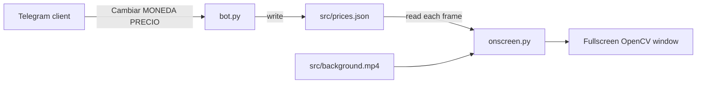

# on-screen-dolar

> **Problem thesis (required):** on-screen-dolar exists to turn any connected display into a live Argentine exchange-rate board: a looping background video with a scrolling LED-style ticker showing dollar, blue dollar, euro, and Chilean peso quotes against the peso, updatable on demand from a Telegram chat so operators never touch the TV machine directly.

## 1. Identity

| Field | Value |
|-------|-------|
| Org / repo | `kodexArg/on-screen-dolar` |
| Visibility | `private` |
| Default branch | `main` |
| One-line pitch | Python fullscreen video player that overlays a scrolling exchange-rate marquee fed by `src/prices.json`, with a Telegram bot to change quotes remotely. |
| Audience | Internal operators who manage a physical rate board (shop, office, or home TV); future contributors extending WhatsApp or a tkinter remote client per roadmap. |

## 2. Problems it solves

### P1 — Static signage cannot keep pace with intraday FX quotes

- **Who hurts:** Anyone running a physical or on-wall display of informal or official dollar/euro rates in Argentina, where quotes can shift multiple times per day.
- **Pain today:** Updating a TV image or slide deck requires manual graphic work or on-site keyboard access; there is no single source of truth between what is shown and what staff believe is current.
- **How this repo answers:** `src/prices.json` holds the canonical quote map (`DOLAR`, `BLUE`, `EURO`, `CLP`). `onscreen.py` polls that file on every marquee frame via `get_prices_from_json()`, composites scrolling text over a looping MP4 background, and renders fullscreen through OpenCV. When the JSON changes, the ticker text updates without restarting the video loop logic.
- **Out of scope:** Automated scraping of official or parallel-market rates; historical charts; multi-currency conversion calculators; cloud-hosted dashboards.

### P2 — Remote price updates without sitting at the display PC

- **Who hurts:** The person who knows the new rate but is not at the machine hooked to the TV.
- **Pain today:** Walking to the display machine or using ad-hoc file shares to edit JSON is slow and error-prone during busy trading windows.
- **How this repo answers:** `bot.py` implements a Telegram listener. Authorized users send messages in the form `Cambiar <moneda> <precio>` (Spanish command prefix configurable in the `dialog` dict). The bot validates currency keys against `prices.json`, writes the updated JSON, and replies with confirmation. The on-screen marquee picks up new values on its next read cycle.
- **Out of scope:** Multi-tenant bot hosting, rate approval workflows, audit trails beyond log files, WhatsApp integration (listed as future roadmap only).

### P3 — Professional-looking TV output from simple Python tooling

- **Who hurts:** Operators who want a broadcast-style ticker (dimmed lower band, custom LED fonts, fullscreen) without a dedicated signage SaaS or video editor pipeline.
- **Pain today:** Plain text overlays look amateurish; achieving marquee motion and video underlay usually means After Effects or proprietary signage boxes.
- **How this repo answers:** `onscreen.py` blends a background MP4 (`src/background.mp4`, other `src/*.mp4` ignored per `.gitignore` except the example) with a Pillow-drawn RGBA marquee layer. `configuration.py` tunes speed, font, band fade, and frame timing. Custom TTF fonts under `src/fonts/` (monosphere, LED board variants) give an electronic-ticker aesthetic. Escape key exits fullscreen.
- **Out of scope:** Logo overlays, news crawl integration (mentioned as future Scrapy idea in README), multi-monitor orchestration.

## 3. Product / idea

The repository is a **two-process Python signage system** with a shared JSON contract, not a web app. The mental model:

1. **Display lane** (`onscreen.py`): reads `src/prices.json`, renders a horizontal scrolling string of all key–value pairs, alpha-blends it onto video frames, shows fullscreen.
2. **Control lane** (`bot.py`): Telegram long-polling bot; authorized chat users issue price-change commands; bot rewrites `src/prices.json`.
3. **Orchestration stub** (`app.py`): comments describe intent to run display and bot in separate threads, but the file currently only imports `threading`, `onscreen`, and `bot` without wiring — operators likely run modules independently today.

Data flows in one direction: Telegram message → JSON file → marquee text reader. There is no database, queue, or HTTP API between them.

### 3.1 North-star use cases

1. **Shop TV board** — Loop `background.mp4` on a 16:9 display; staff update blue and official dollar lines from phone when the parallel market moves.
2. **Office reference screen** — Show euro buy/sell spread (`EURO` value can encode dual quotes as a single string) alongside CLP cross-rate.
3. **Dev iteration** — Edit `configuration.py` font size and band geometry, swap fonts under `src/fonts/`, test locally with Esc to quit.

### 3.2 Non-goals

- Automated price ingestion (roadmap mentions Scrapy for news, not implemented).
- tkinter remote desktop client (roadmap item 4, not present in tree).
- WhatsApp channel (roadmap stretch goal).
- Production-grade secret management (token currently inline in `bot.py` — see §9).
- Flask/FastAPI HTTP layer (`.gitignore` references it as future pattern; no server code exists).

## 4. Technology stack

Derived from `requirements.txt`, module imports, and `README.md`.

| Layer | Choices | Evidence (path, not URL) |
|-------|---------|--------------------------|
| Runtime / language | Python 3 (pinned deps circa 2023) | `requirements.txt`, `*.py` |
| Display / video | OpenCV 4.7, NumPy 1.24 | `onscreen.py`, `requirements.txt` |
| Image / text | Pillow 9.5, custom TTF fonts | `onscreen.py`, `src/fonts/` |
| Remote control | python-telegram-bot 20.3 | `bot.py`, `requirements.txt` |
| Logging | loguru 0.7 | `bot.py`, `onscreen.py` (import only in bot) |
| HTTP (transitive) | httpx, httpcore, anyio | `requirements.txt` |
| Data | Local JSON file | `src/prices.json` |
| Infra / deploy | None evident — local Python process on display machine | no CI, Docker, or IaC |
| AI / agents | None | no `.claude/`, `.agents/`, or skills |
| Tests | None | no test configs |

### 4.1 Notable dependencies (curated)

- `opencv-python` — video capture, fullscreen window, `addWeighted` alpha compositing of marquee over background frames.
- `Pillow` — RGBA image creation, TrueType text rasterization, marquee animation loop.
- `python-telegram-bot` — async `ApplicationBuilder`, command and text message handlers for price updates.
- `loguru` — rotating file log for bot activity (`logs/bot.log`).
- `numpy` — array bridge between PIL marquee frames and OpenCV display pipeline.

## 5. Repository map (abstraction)

- **Entrypoints:**
  - `onscreen.py` — `main()` → `play_video_loop()`; run directly for TV display.
  - `bot.py` — `main()` → Telegram polling; run directly for remote updates.
  - `app.py` — intended dual-thread launcher (incomplete).
- **Domain / core:**
  - `ExchangePriceBoard` class in `bot.py` — load/set prices, validate currency keys and numeric price strings.
  - `get_prices_from_json()` in `onscreen.py` — format JSON dict into marquee string.
- **Adapters:**
  - Telegram API via `python-telegram-bot` (`bot.py`).
  - OpenCV window / video file I/O (`onscreen.py`).
  - Filesystem JSON persistence (`src/prices.json`).
- **Configuration:**
  - `configuration.py` — marquee speed, font path, band geometry, FPS throttle.
  - `authorized_users.txt` — newline-separated Telegram user IDs allowed to issue commands.
  - `dialog` dict in `bot.py` — Spanish UI strings for bot replies.
- **Assets:**
  - `src/background.mp4` — default looped background (tracked; other `src/*.mp4` gitignored).
  - `src/fonts/*.ttf` — LED and monospace display fonts.
- **Logs:**
  - `logs/bot.log`, `logs/onscreen.log` — runtime logs (contents not ingested for this summary).
- **Docs vaults:** none — no `docs/`, `.docs/`, or ADR directories in tree.
- **Agent scaffolding:** none — no `.claude/` directory.
- **Generated / vendor:** `logs/` may grow at runtime; `node_modules` and `.venv/` are gitignored and absent.

## 6. Configuration & contracts (no secrets)

### Environment and files

| Name / path | Purpose |
|-------------|---------|
| `src/prices.json` | Canonical quote map; keys are currency codes (`DOLAR`, `BLUE`, `EURO`, `CLP`), values are display strings (e.g. `"678 ARS"`). |
| `authorized_users.txt` | Allow-list of Telegram numeric user IDs; one per line. |
| `configuration.py` | `SPEED`, `FONT`, `FONT_SIZE`, `TEXT_BOTTOM`, `BAND_BOTTOM`, `BAND_TOP`, `BAND_FADE`, `FPS` — visual tuning constants. |
| `.env` | Gitignored; intended for future Flask/FastAPI or bot token externalization — not used by current code paths reviewed. |

### Telegram bot contract

- **Command:** `/start` → greeting (`dialog["hello"]`).
- **Text message (authorized users only):** must match `Cambiar <MONEDA> <PRECIO>` — three space-separated tokens, currency uppercased internally, price must parse as float.
- **Responses:** Spanish status strings from `dialog` map; echoes old and new price board on success.

### Display contract

- Marquee reads all keys from `prices.json` every animation frame.
- Background video: first `.mp4` found in `src/` per `draw_bg_video_iter()` iteration order.
- Fullscreen window title `"Video"`; Esc (key code 27) exits.

### 6.1 HTTP / API endpoints (when applicable)

**No HTTP surface.** This repository does not expose REST, WebSocket, or Workers routes. All remote interaction is through the Telegram Bot API (outbound polling from `bot.py`).

| Method | Path | Purpose | Auth (if known) |
|--------|------|---------|-----------------|
| — | — | N/A — no in-repo HTTP server | — |

### 6.2 Other interfaces

- **Telegram Bot API (client):** long-polling via `ApplicationBuilder().run_polling()`; handlers for `/start` and free-text `Cambiar` messages.
- **OpenCV GUI:** fullscreen `imshow` window; keyboard Esc to quit.
- **Filesystem watch (implicit):** marquee re-reads `prices.json` each frame — no inotify; file must be rewritten by bot for updates to appear.

## 7. Data & persistence

- **Store:** single JSON file `src/prices.json` on local disk; no database, KV, or cloud sync.
- **Entities:** currency code → formatted price string (display-oriented, not strict numeric schema).
- **Example shape** (structure only): `{"DOLAR": "<amount> ARS", "BLUE": "...", "EURO": "...", "CLP": "..."}`.
- **Topology:** fully offline/local except Telegram API calls from the bot process. Display machine and bot can co-reside on one PC; JSON is the only shared state. No edge or cloud replication layer.

## 8. Docs & agent memory (required scan)

| Source | Result |
|--------|--------|
| `README.md` | Primary documentation — project pitch, five-item roadmap with done/to-do status per milestone. |
| `docs/**` | **Not present** in repository. |
| `.docs/**` | **Not present** in repository. |
| `.claude/**` | **Not present** in repository. |
| ADR / PRD / constitution | **Not present**. |
| Inline comments | `app.py` threading plan; `bot.py` and `onscreen.py` carry TODO docstrings. |

**Evidence used:**

- `README.md` — roadmap and problem statement.
- `bot.py` — Telegram command format, `ExchangePriceBoard` behavior, authorization model.
- `onscreen.py` — video loop, marquee compositing, JSON read pattern.
- `configuration.py` — display tuning parameters.
- `requirements.txt` — dependency versions.

## 9. Security & privacy notes (summary-time)

- **Visibility:** `private` GitHub repo; summary contains no clone URLs or live credentials.
- **Auth model:** Telegram bot restricts price changes to user IDs listed in `authorized_users.txt`; unauthorized messages are silently ignored (no reply).
- **Secret handling gap:** `bot.py` embeds the Telegram bot token as a string literal in `main()` rather than reading from environment or `.env`. This summary intentionally omits any token value. Operators should rotate the token and move it to environment configuration before wider use.
- **`load_prices` uses `eval()`** on file contents in `bot.py` — prefer `json.load` for safety (display path already uses `json.load`).
- **This summary contains no secrets**, private keys, connection strings, or `.env` contents.

## 10. Operational picture

### Local development / run

- Install deps: `pip install -r requirements.txt` (or virtualenv per `.gitignore` `.venv/`).
- **Display only:** `python onscreen.py` — requires display server access for OpenCV fullscreen; place `background.mp4` in `src/`.
- **Bot only:** `python bot.py` — requires network for Telegram polling; ensure `authorized_users.txt` lists operator Telegram IDs.
- **Combined (planned):** `python app.py` — not yet implemented beyond imports.

### Deployment

- No GitHub Actions, Dockerfile, or wrangler config in tree.
- Expected deployment: long-running Python process on a machine connected to the TV (likely same host as HDMI output).
- Logs rotate at 500 MB for bot (`loguru` config in `bot.py`).

### Hardware constraints

- Needs a graphical environment for OpenCV fullscreen (`WND_PROP_FULLSCREEN`).
- 16:9 video asset assumed per README roadmap item 1.
- No GPU requirement beyond standard OpenCV/Pillow CPU rendering.

## 11. Open questions / unknowns

- **`app.py` threading:** Comment describes two-thread startup but no `threading.Thread` calls exist — unclear if production runs two terminals or a process supervisor instead.
- **README vs code drift:** README marks Telegram bot as "To-do" (roadmap item 3) but `bot.py` is substantially implemented; roadmap item 2 (JSON watcher service) may be satisfied by per-frame re-read rather than a dedicated watcher process.
- **Token management:** Whether a rotated token exists in operator `.env` on the deployment machine vs the committed literal in `bot.py`.
- **Euro dual-quote format:** `EURO` value `"293 ARS / 330 ARS"` appears hand-formatted; no schema enforces buy/sell structure.
- **Last activity:** GitHub metadata shows last push circa August 2024 — active maintenance status uncertain.
- **WhatsApp / tkinter clients:** Roadmap items without code in tree.
